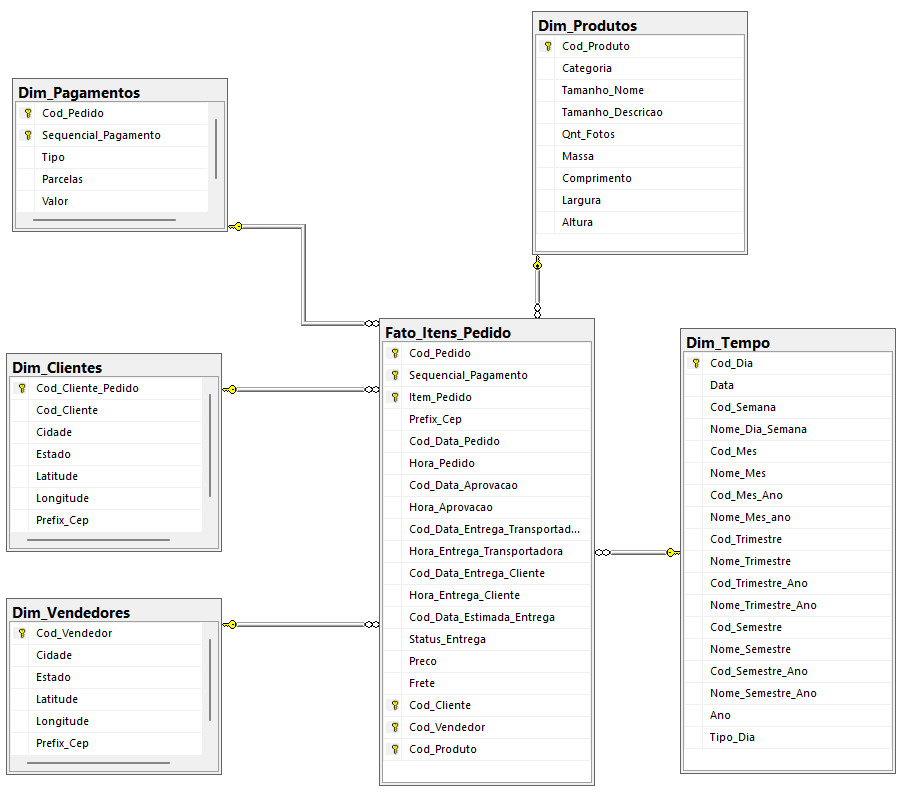
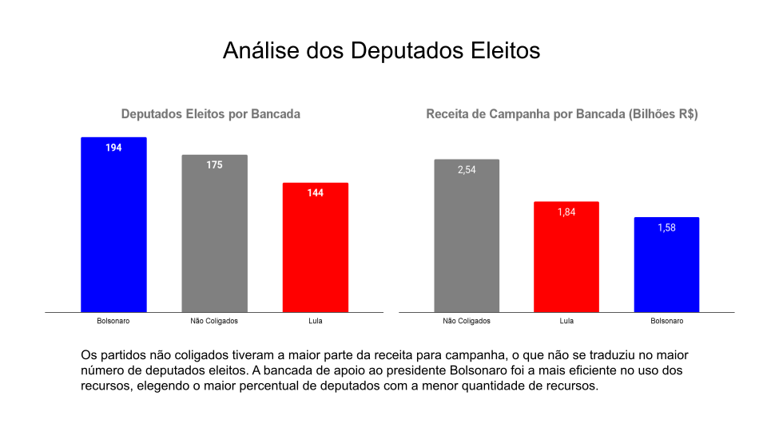
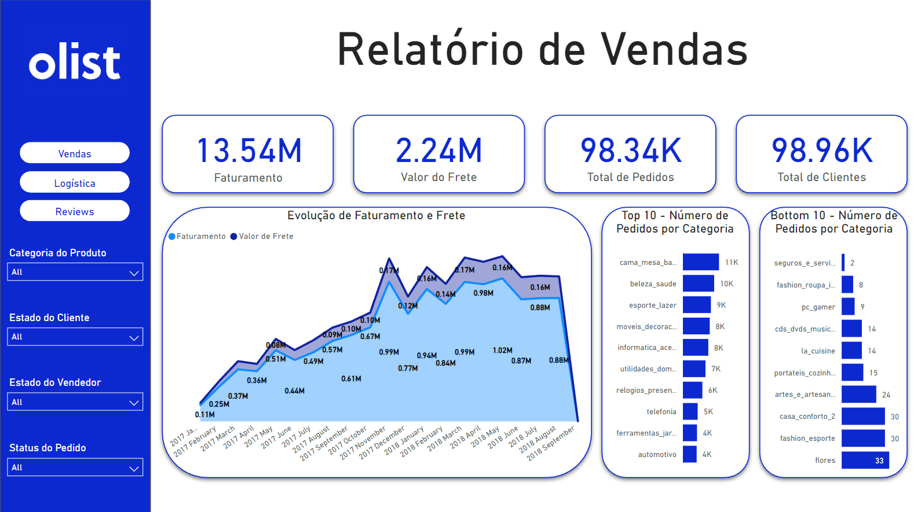

## Olá, eu sou o Pedro Ribeiro

- 🔭 Atualmente trabalhando com projetos de análise de dados
- 🌱 Hoje estou estudando SQL, Python e Power BI
- 👯 Procurando uma oportunidade na área de dados

  <a href="https://github.com/Ribeiro-Pedro">
  
  

 
  
  
  

##

  
  

 ## Projetos relevantes de portfólio
 
 ### Análise exploratória de dados Youtube consumindo API
  
  
Com o intuito de entender melhor o que faz um vídeo ter sucesso na plataforma foi feita uma análise entre os nove canais de data science mais populares do Youtube. Além disso, o projeto serviu como estudo para a obtenção de dados através do consumo da API do Youtube e para análise de dados com a utilização de Python.

<a href = "https://github.com/Ribeiro-Pedro/EDA-Youtube-API">Link do repositório</a>

  
 ### Modelagem de dados relacional vs dimensional. Data warehouse Olist
  
  
Este projeto teve como objetivo a construção de um data warehouse com base em um banco de dados relacional e comparar as diferentes abordagens de modelagem de dados. Os dados utilizados são do dataset de e-commerce disponibilizado pela Olist no Kaggle e pode ser acessado através deste deste <a href='https://www.kaggle.com/datasets/olistbr/brazilian-ecommerce?datasetId=55151&sortBy=voteCount&sort=votes&select=olist_geolocation_dataset.csv'>link</a>.
  
 <a href = "https://github.com/Ribeiro-Pedro/Data-Warehouse-Olist">Link do repositório</a>

 
 ### Análise dos Deputados Eleitos em 2022
 
 
Esta análise se utilizou dos dados das candidaturas coletados e abertos pelo TSE e compilados pela plataforma basedosdados.org, que disponibiliza os dados para consulta através de banco de dados disponíveis para a consulta através do Google Big Query. Para filtrar os candidatos eleitos foi feito um scrapping dos dados das candidaturas eleitas do portal UOL. Este processo foi feito com uso de Python e os dados obtidos foram armazenados em um banco de dados no Google Big Query.

<a href="https://github.com/Ribeiro-Pedro/Analise-Candidatos-Eleitos">Link do repositório</a>

### Dashboard Olist

O projeto foi desenvolvido a partir de uma solicitação hipotética de construção de um painel para a visualização dos dados a partir de três perspectivas: vendas, logística e satisfação do cliente. Os dados escolhidos para o projeto são os disponibilizados pela Olist através da plataforma Kaggle no qual estão dispostos cem mil pedidos com dados sobre produtos, clientes, vendedores, avaliações, formas de pagamento e a geo localização destes, e podem ser acessados através deste <a href='https://www.kaggle.com/datasets/olistbr/brazilian-ecommerce?datasetId=55151&sortBy=voteCount&sort=votes&select=olist_geolocation_dataset.csv'>link</a>.

<a href="https://github.com/Ribeiro-Pedro/DashboardOlist">Link do repositório</a>

